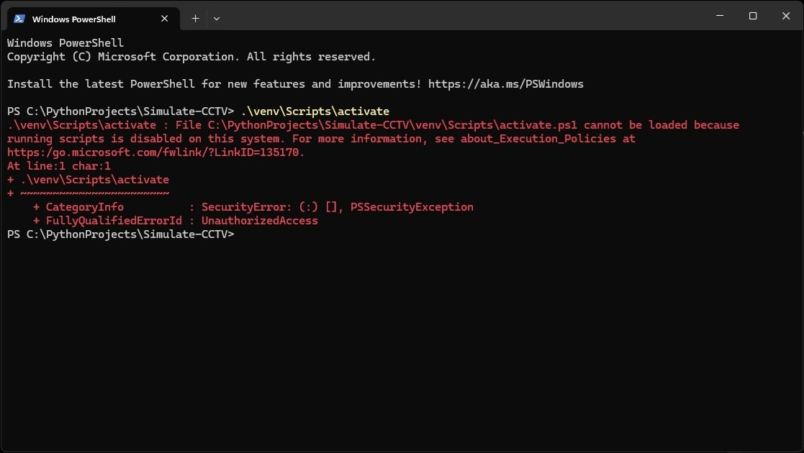
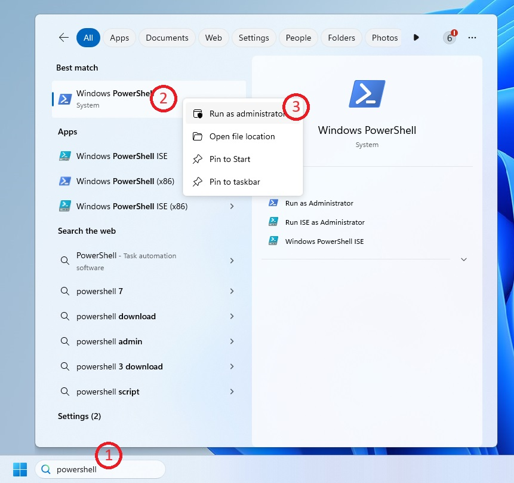
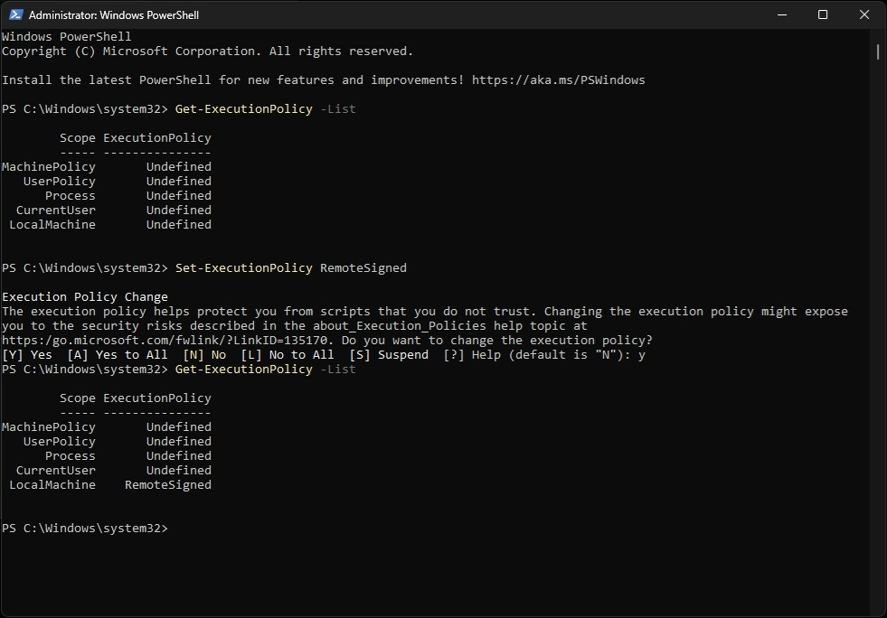
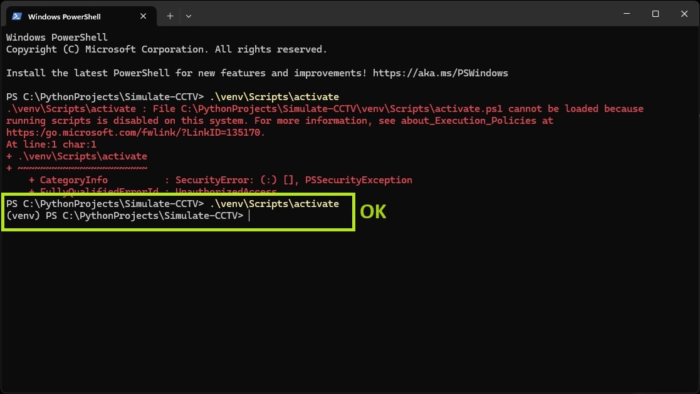

# How to solve the problem unable to activate virtualenv in powershell

-----------------------------------------------

## problem

* activate virtualenv: an error occurred



## solve

### step 1

* open new Windows PowerShell
* run as admin
  

### step 2

```sh
Get-ExecutionPolicy
Set-ExecutionPolicy RemoteSigned
y
 ```



### step 3

* new activate virtualenv

```sh
venv\Scripts\activate
```



